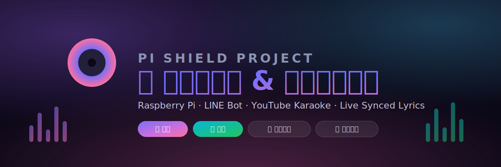
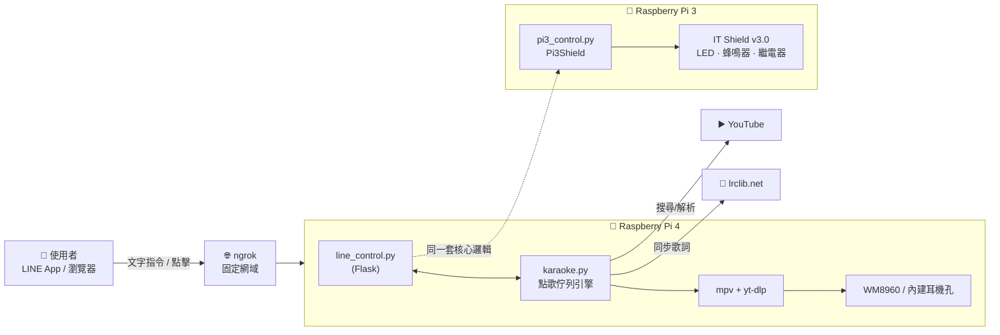

<p align="center">
  
</p>

<p align="center">
  
  
  
  
  
  
</p>

<p align="center">
  一個從「終端機按鍵開燈」開始，一路長成「LINE 聊天室點歌、動態同步歌詞、KTV 風格網頁面板」的樹莓派專案。
</p>

---

## ✨ 這個專案能做什麼

| | |
|---|---|
| 💡 **硬體控制** | 兩顆 LED 燈泡（長亮/閃爍/單獨/一起）、蜂鳴器音符與旋律播放、繼電器開關 |
| 💬 **LINE 聊天室操控** | 所有功能都能直接傳文字指令觸發，不用打開任何 App |
| 🎤 **YouTube 點歌系統** | 多人排隊點歌、原聲/伴奏一鍵切換、歌詞隨播放進度即時捲動 |
| 🔥 **熱門歌曲電台** | K-pop / 中文流行 / 英文流行三個分類，隨機連續播放到你按暫停為止 |
| 🌐 **圖形化網頁面板** | 手機 LINE 內建瀏覽器直接打開就能用，玻璃擬態設計、深淺色主題自動切換 |
| 🔁 **開機自動啟動** | systemd 服務管理，斷電重開機不用手動介入，也撐得過音效卡編號漂移 |

## 🏗️ 系統架構



兩台樹莓派共用同一個 LINE 官方帳號 + 同一個 ngrok 固定網域對外串接，目前實際部署在樹莓派 4 上。GPIO 排針規格相容，之後要把 IT Shield 接回樹莓派 4 使用也沒問題。

## 📸 點歌系統長怎樣

網頁面板 `/karaoke` 是玻璃擬態（Glassmorphism）設計，帶漸層背景、旋轉黑膠唱片動畫、動態同步歌詞，深色/淺色模式跟著系統自動切換。三個熱門歌曲分類各自有專屬漸層配色（K-pop 紫粉、中文流行 紅金、英文流行 藍青）。

## 🗣️ LINE 指令一覽

```
點歌 <歌名>          加入點歌排隊（尾綴加 0 = 伴奏版，例如「點歌 小星星0」）
排隊                 查看目前播放中 + 排隊列表
切歌 / 刪除 <編號> / 頂歌 <編號>
原聲 / 伴奏           切換目前播放版本
熱門 kpop/中文/英文    開始隨機連續播放，直到「暫停熱門」
小樂小樂，我要點歌     取得點歌網頁連結 + 操作手冊
面板 / help          圖形控制面板連結 / 完整指令列表
```

完整指令、按鍵對照、API 說明見 [`pi3_control.md`](pi3_control.md)。

## 📚 文件

| 文件 | 內容 |
|---|---|
| [`HANDOFF.md`](HANDOFF.md) | 完整開發過程紀錄——每個階段做了什麼、踩過哪些坑、為什麼這樣設計，按時間順序寫的第一手記錄 |
| [`pi3_control.md`](pi3_control.md) | 操作手冊：按鍵對照表、LINE 指令列表、Web API 說明 |

## 🔧 硬體

- Raspberry Pi 3 Model B + ITtraining Pi I/O Shield v3.0（2 顆 LED、蜂鳴器、繼電器、按鈕）
- Raspberry Pi 4 Model B（8GB）+ Waveshare WM8960 Audio HAT
- 作業系統：Raspberry Pi OS Lite（Debian Trixie, 64-bit）

## 🧩 主要程式檔案

```
pi3_control.py     LED / 蜂鳴器 / 繼電器核心邏輯 + 終端機按鍵互動介面
line_control.py    Flask app：LINE Webhook、網頁面板、點歌系統路由
karaoke.py         點歌佇列引擎：播放迴圈、mpv IPC、歌詞抓取、熱門歌曲電台
```

## 🔐 安全性備註

這個 repo 是公開的，開發紀錄裡原本會出現的實際密碼、密鑰（SSH/sudo 密碼、LINE Channel Secret/Token、ngrok authtoken）都已經移除或改成佔位文字，只保留架構跟邏輯本身。
