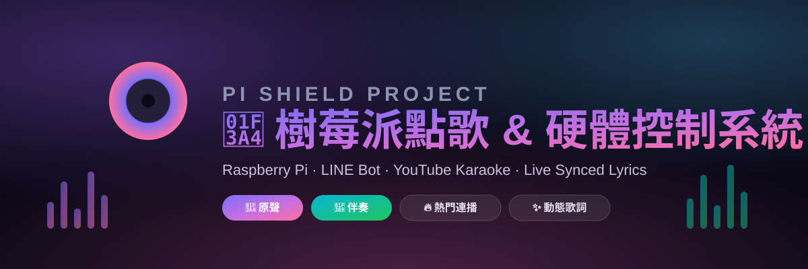

<p align="center">
  
</p>

<p align="center">
  
  
  
  
  
  
  
</p>

<p align="center">
  <b>小樂點歌台</b> —— 一個從「終端機按鍵開燈」開始，一路長成<br/>
  「LINE 用口語點歌、對著麥克風講話就換歌、電視牆同步歌詞」的樹莓派專案。
</p>

---

## ✨ 能做什麼

| | |
|---|---|
| 💬 **LINE 點歌** | 傳「點歌 稻香」就排隊。原聲／伴奏、插隊、刪除、暫停、切歌全部用聊天完成 |
| 🧠 **聽得懂口語** | 比對不到固定指令時，交給本機 LLM 翻譯。「我想聽周杰倫的稻香」「可以跳過這首嗎」都聽得懂 |
| 🎙️ **語音點歌** | 直接在 LINE 傳語音訊息，本機 whisper 轉文字後照一般指令走 |
| 🎤 **麥克風語音控制** | USB 麥克風開關即 push-to-talk，講完關掉就執行，不用打字也不用開手機 |
| 📺 **大螢幕歌詞牆** | `/display` 接電視，超大字歌詞隨播放捲動 |
| 🌐 **網頁控制台** | `/karaoke` 手機電腦都能用。3D 唱盤、跟拍光圈、可互動星空 |
| 🔥 **熱門電台** | K-pop／中文／英文三個頻道隨機連播，四百首候選池不重複 |
| 📊 **點歌統計** | 記錄誰點了什麼，「常點」「熱門排行」直接回數字就能重播 |
| 🌤️ **生活功能** | 查天氣、紅外線遙控風扇 |
| 💡 **硬體控制** | LED、蜂鳴器、繼電器（Pi3 + IT Shield，GPIO 相容 Pi4） |

## 🏗️ 架構

```mermaid
flowchart LR
    U["👤 使用者<br/>LINE App / 瀏覽器"] -->|文字 · 語音 · 點擊| NG["🌐 ngrok<br/>固定網域"]
    MIC["🎙️ USB 麥克風"] --> VC

    NG --> FLASK

    subgraph P4["🍓 Raspberry Pi 4 — 主機"]
        FLASK["line_control.py<br/>Flask：Webhook · 網頁 · API"]
        KARA["karaoke.py<br/>佇列引擎 · mpv IPC · 歌詞"]
        VC["voice_control.py<br/>麥克風常駐"]
        POOL["radio_pool.py<br/>電台候選池"]
        STATS["song_stats.py<br/>SQLite 統計"]
        MPV["mpv + yt-dlp"]
        FLASK <--> KARA
        VC -->|127.0.0.1 /api/voice| FLASK
        KARA --> POOL
        KARA --> STATS
        KARA --> MPV
    end

    subgraph MAC["💻 macOS — AI 後端"]
        OC["openclaw gateway :18789"]
        LM["LM Studio<br/>qwen3-8b"]
        WH["mlx-whisper :8770<br/>large-v3-turbo"]
        OC --> LM
    end

    FLASK -.口語翻譯 nlu.py.-> OC
    FLASK -.語音轉文字 stt.py.-> WH
    VC -.-> WH

    KARA -->|搜尋 / 串流| YT["▶️ YouTube"]
    KARA -->|同步歌詞| LRC["🎼 lrclib.net"]
    MPV --> SPK["🔊 耳機孔 / WM8960"]
```

**Mac 那兩條是可降級的。** Mac 關機時點歌照常運作，只是聽不懂口語、不能語音點歌。
`pi3_line_config.json` 裡有 `nlu_enabled` / `stt_enabled` 兩個開關。

## 🗣️ LINE 指令

```
點歌 <歌名>            加入排隊（尾綴加 0 = 伴奏版，例如「點歌 小星星0」）
@任何稱呼 <歌名>        跟點歌一樣但更口語，例如「@小樂 稻香」
推薦 <歌手>            不知道歌名時列該歌手前 5 首，回數字直接點
排隊                   目前播放中 + 排隊列表
切歌 / 刪除 <編號> / 頂歌 <編號>
暫停 / 繼續            從原位置接著播，不會重頭
原聲 / 伴奏            切換目前播放的版本
停止                   停止並清空排隊
熱門 kpop/中文/英文     隨機連播，直到「暫停熱門」
常點 / 熱門排行         個人與全場統計，回數字直接點
天氣 / 開風扇 / 關風扇
大螢幕 / 面板 / help
```

以上都比對不到時，會交給本機 LLM 翻譯成上面某一條再執行。
**直接傳語音訊息也可以點歌。**

完整按鍵對照與 Web API 見 [`docs/pi3_control.md`](docs/pi3_control.md)。

## 🚀 部署

```bash
deploy/deploy.sh            # 推送並重啟，最後驗證頁面內容
deploy/deploy.sh --check    # 只比對 repo 與樹莓派的差異
```

第一次安裝、systemd unit、設定檔範本見 [`deploy/README.md`](deploy/README.md)。
Mac 端那兩個服務見 [`mac-services/README.md`](mac-services/README.md)。

## 📚 文件

| 文件 | 內容 |
|---|---|
| [`docs/HANDOFF.md`](docs/HANDOFF.md) | **交接文件**。前半是架構／部署／維運／疑難排解，後半是按時間順序的第一手開發歷程 |
| [`docs/pi3_control.md`](docs/pi3_control.md) | 操作手冊：按鍵對照、LINE 指令、Web API |
| [`docs/smart-home-architecture.md`](docs/smart-home-architecture.md) | **智慧家庭架構規劃**：兩台樹莓派分工、必買清單、推進順序 |
| [`docs/smart-home-setup.md`](docs/smart-home-setup.md) | **無線開關 → 紅外線**：Aqara 中樞橋接的設定步驟（尚未對真實硬體驗證） |
| [`deploy/README.md`](deploy/README.md) | 部署步驟、systemd、驗證方式 |
| [`mac-services/README.md`](mac-services/README.md) | Mac 端 NLU／STT 服務與 openclaw 設定 |
| [`docs/reports/`](docs/reports/) | 週報 |

## 🔧 硬體

- **Raspberry Pi 4 Model B (8GB)** —— 主機。Raspberry Pi OS Lite (Debian Trixie, 64-bit)
- **Raspberry Pi 3 Model B + ITtraining Pi I/O Shield v3.0** —— 2 顆 LED、蜂鳴器、繼電器、按鈕
- **USB 麥克風** —— 有實體開關，關掉會切斷 USB 供電，正好當 push-to-talk
- **Waveshare WM8960 Audio HAT** —— 已裝但**錄音端實測不可用**（峰值恆為 0，三種裝置路徑
  都試過），目前只用內建耳機孔輸出
- **macOS** —— 跑本機 LLM 與 whisper

## 🧩 程式檔案

```
src/line_control.py    Flask：LINE Webhook、網頁面板、/display、所有 API 路由
src/karaoke.py         點歌佇列引擎：播放迴圈、mpv IPC、歌詞抓取、音量、暫停
src/voice_control.py   麥克風常駐：錄音、增益自動校正、幻覺過濾、送 STT
src/nlu.py             口語 → 指令翻譯層（打 Mac 的 openclaw）
src/stt.py             語音轉文字（打 Mac 的 mlx-whisper）
src/radio_pool.py      電台候選池，會自己長大，避免短期內重複
src/song_stats.py      SQLite 點歌統計
src/weather.py         天氣查詢
src/ir_remote.py       紅外線遙控（博聯小黑豆，區網直連不走雲端）
src/aqara_hub.py       Aqara 中樞的區網協定用戶端（只聽事件，不需金鑰）
src/switch_bridge.py   無線開關 → 紅外線 橋接常駐程式
src/pi3_control.py     LED / 蜂鳴器 / 繼電器 + 終端機互動介面

deploy/                systemd unit、設定檔範本、部署腳本
mac-services/          Mac 端 whisper 服務與 LaunchAgent
pi3_basic/             Pi3 Shield 的 C 語言基礎範例（bcm2835）
```

## 🔐 安全性

- **`/karaoke` 網頁面板沒有任何驗證**——知道 ngrok 網址的人就能控制播放。
  所以 repo 裡的 ngrok 網域是佔位字串
- `/api/voice` 限制只接受 `127.0.0.1`，其他來源回 403
- LINE Webhook 驗簽章
- 密鑰放 `pi3_line_config.json`（`chmod 600`，在 `.gitignore` 裡），範本見 `deploy/`
- 這個 repo 是公開的，開發紀錄裡的密碼、密鑰、網域都已改成佔位文字
